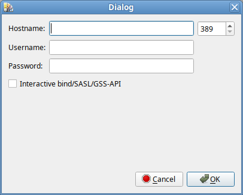
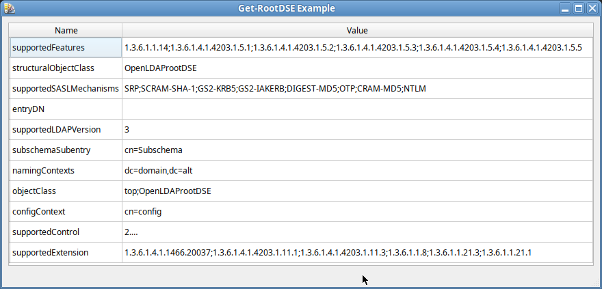

# Documentation for the Get-RootDSE Example Program using the libdomain Library

## Overview

The provided example is a C program that demonstrates the use of the libdomain library to perform an LDAP search operation.
The program establishes a connection to the LDAP server and executes a search reques to get RootDSE entry in the specified directory server.

## Compilation

To compile the program, you need to install the libdomain library.

```bash
apt-get install libdomain-devel libconfig-devel cmake rpm-build qt5-base-devel glib2-devel
```

Clone the example:

```bash
git clone https://github.com/libdomain/libdomain-qt-sample
```

Use the following compilation command:

```bash
cd libdomain-qt-sample && mkdir build && cd build && cmake .. && make -j `nproc`
```

## Usage

The program has connection dialog to allow user to specify LDAP server connection parameters.

```bash
./libdomain-qt-sample
```

### Connection dialog


### Main window


## Program Structure

The program consists of the following modules:

1. **MainWindow:**
   - This class initializes the "libdomain" library. Note that we do not start a new event loop; instead, we use the Qt event loop. 
To achieve this, no additional steps are required; initializing the library is sufficient.

```cpp
#include <ldap.h>
#include <talloc.h>

extern "C"
{
#include <libdomain/common.h>
#include <libdomain/domain.h>
#include <libdomain/domain_p.h>
#include <libdomain/directory.h>
#include <libdomain/entry.h>
#include <libdomain/connection_state_machine.h>
}

class CallbackHelper : public QObject
{
    Q_OBJECT
public:
    explicit CallbackHelper(QObject* parent)
        : QObject(parent)
    {}

signals:
    void ready();
};

CallbackHelper* helper = nullptr;

void connection_on_update(verto_ctx *ctx, verto_ev *ev)
{
    Q_UNUSED(ctx);

    ldap_connection_ctx_t* connection = static_cast<ldap_connection_ctx_t*>(verto_get_private(ev));

    if (connection->state_machine->state == LDAP_CONNECTION_STATE_RUN)
    {
        verto_del(ev);

        if (helper)
        {
            helper->ready();
        }
    }
}

MainWindow::MainWindow(ConnectionSettings *settings, QWidget *parent)
    : QMainWindow(parent),
      ui(new Ui::MainWindow)
{
    helper = new CallbackHelper(this);

    TALLOC_CTX* talloc_ctx = talloc_new(nullptr);

    const int update_interval = 10;

    ld_config_t *config = ld_create_config(talloc_ctx, settings->hostname, 0, LDAP_VERSION3, settings->bind_dn,
                              settings->username, settings->password, !settings->useSasl, false, settings->useSasl, false,
                              update_interval, talloc_strdup(talloc_ctx, ""), talloc_strdup(talloc_ctx, ""), talloc_strdup(talloc_ctx, ""));

    LDHandle *handle = nullptr;
    ld_init(&handle, config);

    ld_install_default_handlers(handle);
    ld_install_handler(handle, connection_on_update, update_interval);

    ui->setupUi(this);

    connect(helper, &CallbackHelper::ready, [&, handle]()
    {
        ui->tableView->setModel(new AttributesModel(handle, this));
    });
}
```

2. **AttributesModel:**
   - This class, inherited from QStandardItemModel, performs the main work. It sends a request to the LDAP server, obtaining a list of attributes from the RootDSE record.
   - In the constructor, we create a search query for libdomain and retrieve the list of attributes using the `search_callback` function. Once the `search_callback` emits the `AttributesModelPrivate::ready` signal, we begin populating the model with data. It is assumed that by this point, we already have an initialized `ldhandle` pointer, and the connection is already established.

```cpp
    d->handle = ldhandle;

    privateData = d.get();

    search(d->handle->connection_ctx,
           "",
           LDAP_SCOPE_BASE,
           NULL,
           const_cast<char**>(LDAP_ATTRS),
           0,
           search_callback);

    connect(d.get(), &AttributesModelPrivate::ready, [&]()
    {
        for (size_t i = 0; i < d->attributes.size(); ++i)
        {
            QStandardItem* nameItem = new QStandardItem();
            nameItem->setText(d->attributes[i].name);

            QStandardItem* valueItem = new QStandardItem();
            valueItem->setText(d->attributes[i].values.join(";"));

            this->appendRow({nameItem, valueItem});
        }
    });
```

3. **ConnectionDialog:**
   - This class contains the connection settings dialog. Upon successful completion, it creates a `ConnectionSettings` structure.

4. **ConnectionSettings:**
   - This class holds connection settings, such as the server, username, password, bind_dn, and the use of interactive connection.

## Error Handling

The error handling is performed automatically by the libdomain library using its built-in functions. If desired, you can set your own error handler using the function `ld_install_error_handler(handle, connection_on_error)` and passing in your own `connection_on_error` callback.

## Version Information

- Program Version: 1.0.0

## License

This program is distributed under the GPLv2 license. See the accompanying LICENSE file for detailed information.
